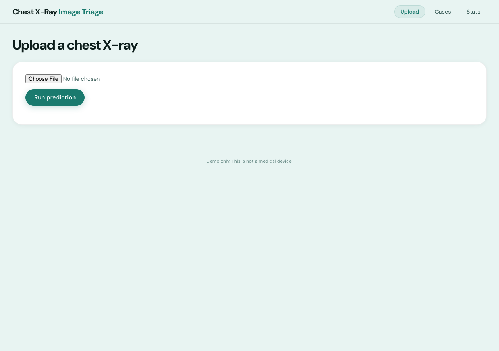
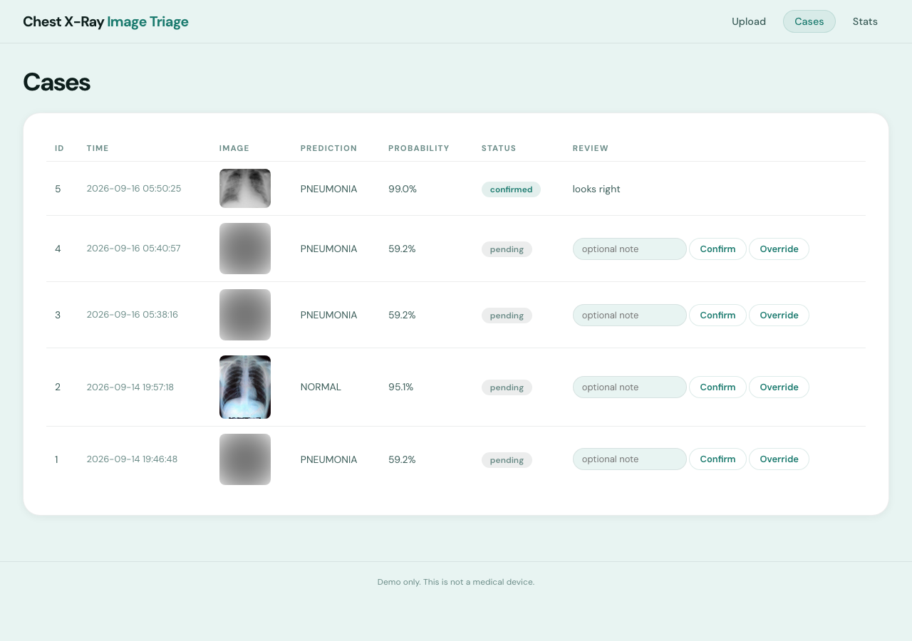

# Chest X-Ray Image Triage

A small demo that mimics how hospitals triage chest X-rays.
You upload an X-ray image, a pretrained model gives a probability score
for pneumonia, and a human reviewer can confirm or override the model.
Every prediction is saved to a database.

## Warning

This is a demo, not a medical device. The model is not validated for
real clinical use. Do not use it to make any medical decision.
The same warning is shown on the upload screen.

## The model

The app uses `nickmuchi/vit-finetuned-chest-xray-pneumonia` from
Hugging Face, a small model trained on chest X-ray images
(labels: NORMAL and PNEUMONIA).

No GPU is required. The model runs on a normal CPU and takes a few
seconds per image. If you have a GPU, PyTorch will use it automatically
and predictions will be faster, but nothing in the code requires one.

The model weights (about 350 MB) are downloaded during the Docker build,
or on the first run if you run without Docker.

## How to run

With Docker (one command):

```
docker compose up --build
```

Without Docker:

```
./run.sh
```

Then open http://localhost:8000 in your browser. The model loads in the
background, so wait for the health check to say "ready" before uploading.

## The screens

- Upload: pick an X-ray image, run the model, see the prediction.
- Cases: every past prediction, with confirm and override buttons.
- Stats: simple counts and how often the human agreed with the model.

### Upload



### Cases



## API routes and curl examples

Run a prediction on an image file:

```
curl -X POST http://localhost:8000/predict -F "file=@xray.jpg"
```

List past cases (page with limit and offset):

```
curl "http://localhost:8000/cases?limit=10&offset=0"
```

Review case number 1 (decision is "confirmed" or "overridden", note is optional):

```
curl -X POST http://localhost:8000/cases/1/review \
  -H "Content-Type: application/json" \
  -d '{"decision": "confirmed", "note": "looks right"}'
```

Get the counts:

```
curl http://localhost:8000/stats
```

Check if the model has finished loading:

```
curl http://localhost:8000/health
```

## Error behavior

- Uploading a file that is not an image returns 400 with a clear message.
- An image the model cannot handle returns 422 and is logged.
- Calling predict before the model has loaded returns 503.
- An empty case list is normal, the Cases page just says "No cases yet."

## Tests

```
pytest
```

The tests replace the real model with a fake one, so they run fast and
do not download anything.

## Project layout

```
app/
  main.py            the API routes
  model.py           loads the model, runs predictions
  db.py              all database code (plain sqlite3)
  static/index.html  the whole frontend, one page
tests/
  test_api.py        tests for every route
Dockerfile
docker-compose.yml
run.sh
requirements.txt
```
