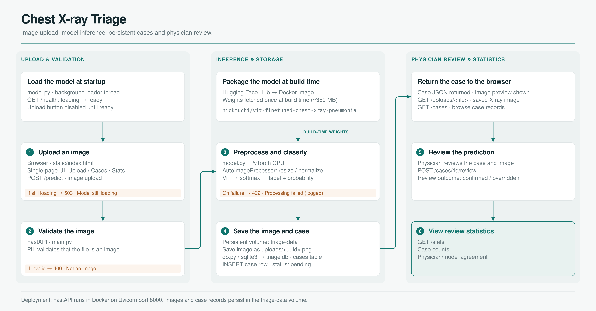

# Chest X-Ray Image Triage



I built this small demo to mimic how hospitals triage chest X-rays.
You upload an X-ray image, a pretrained model gives a probability score
for pneumonia, and a human reviewer can confirm or override the model.
Every prediction is saved to a database.

## The model

I use `nickmuchi/vit-finetuned-chest-xray-pneumonia` from
Hugging Face, a small model trained on chest X-ray images
(labels: NORMAL and PNEUMONIA).

No GPU is required. The model runs on a normal CPU and takes a few
seconds per image. If you have a GPU, PyTorch will use it automatically
and predictions will be faster, but nothing in my code requires one.

The model weights (about 350 MB) are downloaded during the Docker build,
or on the first run if you run without Docker.

## How to run

With Docker (one command):

```
docker compose up --build
```

Without Docker:

```
./run.sh
```

Then open http://localhost:8000 in your browser. I load the model in the
background, so wait for the health check to say "ready" before uploading.

## The screens

- Upload: pick an X-ray image, run the model, see the prediction.
- Cases: every past prediction, with confirm and override buttons.
- Stats: simple counts and how often the human agreed with the model.

### Upload


### Cases


## Error behavior

- Uploading a file that is not an image returns 400 with a clear message.
- An image the model cannot handle returns 422 and is logged.
- Calling predict before the model has loaded returns 503.
- An empty case list is normal, the Cases page just says "No cases yet."

## Tests

```
pytest
```

My tests replace the real model with a fake one, so they run fast and
do not download anything.

## Project layout

```
app/
  main.py            the API routes
  model.py           loads the model, runs predictions
  db.py              all database code (plain sqlite3)
  static/index.html  the whole frontend, one page
tests/
  test_api.py        tests for every route
Dockerfile
docker-compose.yml
run.sh
requirements.txt
```
